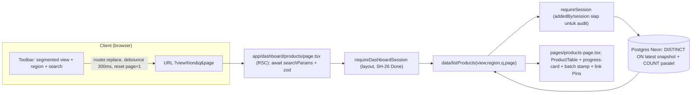
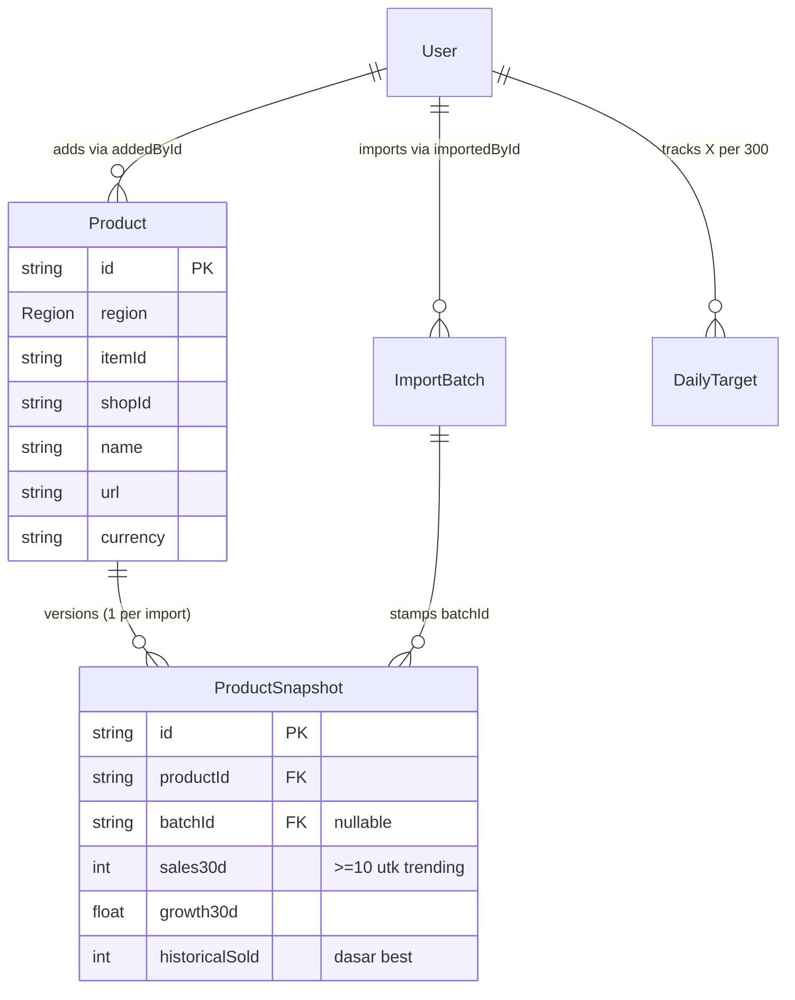

# PHASE 1 — Katalog + Filter Best/Trending Spec (Issue SH-6)

> Guideline implementasi `SH-6 [products] Katalog + filter best/trending` + sub `SH-11, SH-14, SH-17`.
> Sumber: `docs/superpowers/specs/2026-09-16-shopee-affiliate-curation-design.md` (§6 F2–F5, §7, §8, §9), Linear `SH-6` (blockedBy `SH-5` Done + `SH-26` Done; blocks `SH-9`, `SH-10`), analisis sesi ini, riset Exa 2026-09-17.
> Branch: `feature/sh-6-products-katalog-filter-besttrending`. Prasyarat sudah Done: DB 6 tabel + fixture (`SH-5`), auth guard + session (`SH-26`).

# 1. Konteks & Visi Produk

- **Tentang Aplikasi**: Shofiliate membantu affiliate live streamer Shopee memenuhi target **300 produk potensial per hari per streamer**. Masalah hari ini: pencarian produk manual, evaluasi Best Seller & Trending manual, kategorisasi region manual (MY utama + SG, ID, TH, PH, VN) di atas tabel tanpa otomasi. SH-6 membangun **satu page katalog** (`/dashboard/products`) dengan filter `view=all|best|trending` + region (default MY) + search + sort yang benar dan shareable via URL — Best/Trending adalah filter, bukan page terpisah; Pins tetap page tersendiri (`SH-9`).
- **Latar belakang (riset Exa 2026-09-17)**:
  - Produk sejenis (ID/MY): **Shoptik** (dipakai 2900+ affiliate/seller, sortir penjualan total vs saat ini, analisa trending) dan **Shopdora** (9 market termasuk MY/SG/ID/TH/PH/VN, update harian, sales + growth) memvalidasi pendekatan kita: ranking per-region dari data snapshot, bukan klaim real-time.
  - Metodologi industri: **Best = all-time/total units** (bukan revenue — revenue bias ke harga mahal), **Trending = velocity jendela 7–30 hari**, recalculation harian, dan **minimum threshold** agar produk low-data tidak merusak ranking. Ini persis formula §7 kita (`total_sales` vs `sales_30d` + syarat `sales_30d >= 10`).
  - Pola katalog terfilter: **URL sebagai single source of truth** (shareable, refresh-safe, back-button benar), Server Component membaca `searchParams` + fetch, toolbar client hanya update URL via `router.replace` (bukan `push`), debounce search 300–400ms, reset `page=1` tiap ganti filter, `COUNT` + rows paralel, **PK tiebreaker** (`ORDER BY ..., id`) agar pagination deterministik, skeleton + 3 empty state (initial/filter/search).
- **Tujuan & Sasaran (KPI terukur)**:
  - `REQ-001`: `?view=best&region=MY` terurut `total_sales` desc — reproduksibel dari snapshot yang sama (contoh: `30000 > 1000`).
  - `REQ-002`: `?view=trending` hanya tampilkan `sales30d >= 10`, urut `sales30d` desc lalu `growth30d` (contoh: `322/+1.89% > 19/-43.75%`).
  - `REQ-003`: Setiap kombinasi filter = URL shareable; buka URL di tab bersih menampilkan baris yang sama (kecuali ada import baru).
  - `REQ-004`: Pagination server-side; 1000+ baris tanpa degradasi interaksi (tidak ada fetch seluruh dataset ke client).
  - `REQ-005`: Stempel batch tampil (`Data per: YYYY-MM-DD HH:mm batch #id`) + link ke Pins di toolbar.
- **Target Pengguna (User Personas)**:
  - `Streamer (role=user)`: filter katalog per region setiap hari untuk penuhi target 300; bagikan URL view ke tim.
  - `Admin/Lead (role=admin)`: evaluasi kualitas katalog per region; progres semua user (progres card baca `DailyTarget`, ringan).
  - `Engineer`: implementasi `data/` + toolbar + kolom mengikuti `AGENTS.md`.
- **Non-goals (Out SH-6)**: page best/trending terpisah, chart, page Pins (SH-9), uploader import (SH-7), input manual (SH-8), export excel, virtualisasi, `togglePin` (SH-22 — tombol pin di katalog tetap placeholder), edit metrik manual.
- **Keputusan terkunci (asumsi bila belum dijawab)**:
  - `D-01`: Trending = `sales30d >= 10` (bukan null-check — konsekuensi `"-"→0` dari SH-5).
  - `D-02`: Kolom non-PRD (`price, xtraCommission, live, sosmed, video, rating, stock, numAffiliate`) **dibuang**, diganti 11 kolom §9.
  - `D-03`: Pagination server-side offset penuh sejak awal (`page`, `pageSize`, `COUNT` paralel).
  - `D-04`: Native `useSearchParams` + `router.replace` (param hanya `view/region/q/page`), tanpa library `nuqs`.
  - `D-05`: Route kanonis `/dashboard/products` (PRD induk). Status `/dashboard/produk` tim = **open decision** (lihat Risiko R-06).
- **Arsitektur & alur sistem**:

- **Metrik keberhasilan**: AC SH-6 (3 item) + AC SH-11/14/17 lolos di data fixture asli; tidak ada `useState` tersisa untuk param URL; `EXPLAIN` query utama = Index Scan (bukan Seq Scan) via index `(productId,scrapedAt)` + `(sales30d,growth30d)` + `(historicalSold)` yang sudah ada dari SH-5.

# 2. Matriks Otorisasi & Hak Akses Fitur (RBAC)

| Modul / Fitur | Deskripsi Singkat | Aktor yang Berhak Mengakses | Hak Akses | Route / Endpoint Scope |
|---|---|---|---|---|
| Katalog read (`listProducts`) | Baca produk + snapshot terakhir per view/region/q/page | Streamer (semua katalog), Admin (sama) | Read only (scoped: session wajib, guard layout) | `/dashboard/products` + `features/products/data/` |
| Toolbar filter | Ubah view/region/search/page (URL state) | Streamer, Admin | Interact (client, tanpa mutasi DB) | `/dashboard/products?view&region&q&page` |
| Stempel batch | Baca `ImportBatch` terakhir | Streamer, Admin | Read only | bagian dari `listProducts` |
| Progress X/300 | Baca `DailyTarget` milik sendiri / semua (admin) | Streamer (own), Admin (all) | Read only | header tabel katalog |
| Pin/unpin dari katalog | Aksi tulis pin | — (bukan SH-6) | Denied di scope ini (placeholder toast tetap) | `SH-22` (SH-9) |
| Import/manual | Tulis produk/snapshot | — (bukan SH-6) | Denied di scope ini | `SH-7`, `SH-8` |

`CON-001`: `data/` diawali `import "server-only"`, panggil `requireSession()` dulu, tidak diimport dari client component; props RSC→client serializable (`Decimal→number`, `Date→ISO string`).
`CON-002`: Tidak ada endpoint tulis di SH-6. Tidak ada RLS baru (otorisasi di layer actions/data seperti SH-5).

# 3. Breakdown Pekerjaan Teknis (Epic & Task)

> Konvensi mengikat (`AGENTS.md`): `app/` hanya route caller RSC; `features/products/` = `schemas.ts` + `types.ts` + `data/` + `actions/` + `pages/` + `components/`; import `@/` alias; Prisma via `@/lib/prisma.ts`.
> Formula §7 (tidak berubah):
> `rank_best = sort_desc(total_sales)`; `rank_trend = sort_desc(sales_30d, growth_30d)` dengan syarat `sales_30d >= 10`.
> ERD (subset relevan SH-6):

### [MOD-01] - Data listProducts + schemas (SH-11)

- **Aktor Terkait**: Streamer, Admin, Engineer.
- **User Story**:
  > Sebagai streamer, saya ingin katalog terfilter best/trending yang datanya dari snapshot terakhir sehingga ranking selalu benar dan bisa di-share via URL.
- **Daftar Pekerjaan**:
  - [ ] **Backend & Database**:
    - Buat `features/products/schemas.ts`: zod `catalogParamsSchema` (`view: all|best|trending default all`, `region: Region default MY`, `q` string max 100 default `""`, `page` coerce int >=1 default 1, `pageSize` coerce int batas 10–100 default 25). Allowlist kolom sort (anti injection logika).
    - Buat `features/products/data/list-products.ts` (`import "server-only"`): `listProducts(params)` → `{ rows: ProductDTO[], total: number, batch: { id, fileName, createdAt } | null }`.
    - Query inti **`DISTINCT ON (productId)` + `ORDER BY productId, scrapedAt DESC`** via `$queryRaw` (Postgres-native, 1 query — `findMany distinct` Prisma 7 jalan in-memory, tidak layak skala ribuan). Bungkus ranking: `best` → `ORDER BY historicalSold DESC, id DESC`; `trending` → `WHERE sales30d >= 10 ORDER BY sales30d DESC, growth30d DESC, id DESC` (**PK tiebreaker wajib** agar pagination deterministik — temuan riset). `all` → `ORDER BY scrapedAt DESC, id DESC`.
    - Filter: `region` selalu; `q` → `ILIKE` (`name`, `shopName`); pagination `LIMIT/OFFSET`; `COUNT(DISTINCT productId)` paralel via `Promise.all`.
    - Pilih kolom eksplisit (hindari `SELECT *` gaya `information_schema` — adapter Neon gagal deserialize tipe `name`; cast `::text` bila perlu). `Decimal→number`, `Date→ISO`.
    - `requireSession()` di awal; tambah tipe `View`, `ProductDTO`, `ListProductsResult` di `types.ts` (DTO serializable).
  - [ ] **Frontend & UI**: tidak ada (pure data). Verifikasi via script/tsx + Studio.
- **Acceptance Criteria**:
  - `AC-110`: Given fixture (+ snapshot uji 400), When `view=best&region=MY`, Then urutan `30500/400-batch > 30000 > 1000` dari snapshot **terakhir per produk** (produk tidak double-count).
  - `AC-111`: Given sama, When `view=trending`, Then hanya `sales30d>=10`, urut `400 > 322 > 19`.
  - `AC-112`: Given `q=COSRX`, When dipanggil, Then hanya baris cocok (ILIKE) + `total` konsisten dengan rows.
  - `AC-113`: Given tanpa session, When dipanggil, Then throw `AUTH_UNAUTHORIZED`.

### [MOD-02] - Route searchParams + toolbar URL (SH-14)

- **Aktor Terkait**: Streamer, Admin.
- **User Story**:
  > Sebagai streamer, saya ingin setiap filter berwujud URL sehingga bisa di-bookmark dan dibagikan ke tim dengan hasil yang sama.
- **Daftar Pekerjaan**:
  - [ ] **Backend & Database**: ubah `app/dashboard/products/page.tsx` jadi RSC async: `await searchParams` (**Promise di Next 16 — wajib await**), parse via `catalogParamsSchema` (invalid → fallback default, jangan 500), panggil `listProducts`, oper ke `pages/products-page.tsx`.
  - [ ] **Frontend & UI**:
    - Buat `components/products-toolbar.tsx` (client): segmented `Semua|Best Seller|Trending` + `Select` region (default MY) + `Input` search (debounce 300ms) + tombol link "Lihat Pins" (`/dashboard/products/pins`, target mendarat di SH-9) + tombol `Import`/`Input manual` (link ke rute SH-7/SH-8, non-aktif bila rute belum ada — jangan bangun halamannya).
    - Semua perubahan via `router.replace(pathname + ?params)` (**replace, bukan push**); ganti filter apa pun reset `page=1`; pertahankan param lain yang sudah ada.
    - Bungkus komponen pemakai `useSearchParams` dengan **`<Suspense>`** (tanpa ini build gagal).
    - Cabut state lokal `query`/`category` di `product-table.tsx:60-66` untuk param yang pindah ke URL; tabel terima `data + total + page/pageSize` dari server (matikan `createPaginatedRowModel` lokal → pagination dikontrol server).
    - `pages/products-page.tsx`: komposisi header (judul + batch stamp) + toolbar + tabel + footer; terima props serializable saja.
- **Acceptance Criteria**:
  - `AC-140`: Given klik `Trending`, When URL dibaca, Then `?view=trending&region=MY` + tabel re-fetch benar.
  - `AC-141`: Given URL `?view=best&region=MY&q=cosrx` dibuka di tab bersih, Then tampil hasil sama (modulo import baru).
  - `AC-142`: Given ketik search cepat, When diamati, Then fetch hanya setelah debounce + `page` kembali 1.

### [MOD-03] - Kolom §9 + sort default + batch stamp (SH-17)

- **Aktor Terkait**: Streamer, Admin.
- **User Story**:
  > Sebagai streamer, saya ingin kolom metrik aktual (likes/sales/growth/total/gmv/listed) dengan sort default per view sehingga best/trending langsung terbaca tanpa setting manual.
- **Daftar Pekerjaan**:
  - [ ] **Backend & Database**: tidak ada (reuse MOD-01). Tambah baca `DailyTarget` user hari ini untuk progress-card (ringan, 1 query).
  - [ ] **Frontend & UI**:
    - Tulis ulang `product-columns.tsx`: **hapus** kolom non-PRD, tulis 11 kolom §9 (`pin` aksi placeholder → `product_name`(link+seller sub) → `region` Badge → `category` truncate+tooltip → `likes` → `sales_30d` → `growth_30d` Badge hijau/merah → `total_sales` bold saat best → `gmv_30d` + simbol asli → `listed_on` → `actions` dropdown: Lihat di Shopee, Pin (placeholder SH-9), Koreksi region (SH-8)). Definisi kolom disiapkan reuse untuk `pin-columns` SH-10.
    - Sort default per view: `best→total_sales desc`, `trending→sales_30d desc, growth_30d desc`, `all→scrapedAt desc`; `SORTABLE_COLUMNS` allowlist sinkron dengan server.
    - Header tabel: `progress-card X/300` kiri + stempel kanan (`Data per: YYYY-MM-DD HH:mm batch #id` + Tooltip "Lihat metodologi" §7).
    - States: loading → `Skeleton` (pakai `loading.tsx` route bila perlu); kosong → `No results` + CTA import/koreksi (reuse pola `product-table.tsx:290-309`).
- **Acceptance Criteria**:
  - `AC-170`: Given `?view=best`, When dibaca, Then `total_sales` desc (`30500 > 30000 > 1000` di data dev saat ini).
  - `AC-171`: Given `?view=trending`, When dibaca, Then `sales_30d` desc lalu `growth_30d` (`400 > 322/+1.89% > 19/-43.75%`).
  - `AC-172`: Given mobile viewport, When dibaca, Then tidak overflow (truncate + tooltip).
  - `AC-173`: Given batch baru masuk, When katalog dibuka, Then stempel berubah mengikuti `ImportBatch` terakhir.

### [MOD-04] - Verifikasi DoD + Linear (penutup SH-6)

- **Aktor Terkait**: Engineer.
- **User Story**:
  > Sebagai engineer, saya ingin DoD SH-6 terbukti end-to-end sebelum unblock SH-9/SH-10.
- **Daftar Pekerjaan**:
  - [ ] **Backend & Database**: `EXPLAIN` query MOD-01 (harus Index Scan via index SH-5); uji di data fixture + snapshot uji (produk double-snapshot tidak double-count).
  - [ ] **Frontend & UI**: uji 3 acceptance SH-6 di browser (best/trending/URL-share) + cek tidak ada regresi seleksi/pagination lama.
- **Acceptance Criteria**:
  - `AC-060`: `?view=best` urut `total_sales` desc. `AC-061`: `?view=trending` sembunyikan `<10`, urut benar. `AC-062`: filter URL shareable. Lalu `SH-11/14/17`→Done, `SH-6`→In Review.

# 4. Dependency, Urutan Pengerjaan & Risiko

- **Urutan Eksekusi**: `schemas.ts` + `types.ts` (DTO) → `MOD-01` (query + AC-110–113 di data asli) → `MOD-02` (route + toolbar + cabut state lokal) → `MOD-03` (kolom + sort default + stamp) → `MOD-04` (DoD + Linear). Jangan bangun toolbar sebelum query stabil.
- **Blokir & Dependensi**: prasyarat Done (`SH-5` DB + PR, `SH-26` guard/session). SH-6 memblokir `SH-9` (pins page reuse query/kolom) dan `SH-10` (polish reuse kolom). Sejajar non-blokir: `SH-7` import, `SH-8` manual.
- **Potensi Risiko Teknis**:
  - `R-01 (double-count)`: TERBUKTI ada di data dev (produk 12991894555 × 2 snapshot) — mitigasi = `DISTINCT ON` di MOD-01; jangan tambal di UI.
  - `R-02 ($queryRaw + Neon)`: pilih kolom eksplisit; cast `::text` untuk tipe `name`; jangan `SELECT *` gaya introspeksi.
  - `R-03 (Next 16 + Suspense)`: `searchParams` adalah Promise (await!); `useSearchParams` wajib dalam `<Suspense>` atau build gagal.
  - `R-04 (pagination deterministik)`: tiebreaker `id` wajib di semua ORDER BY; tanpa itu baris kembar flicker antar-halaman.
  - `R-05 (semantik trending)`: teks acceptance ("sembunyikan null") usang vs keputusan `>=10` — implementasi ikut D-01; catat di komentar review.
  - `R-06 (/dashboard/produk tim)`: rute + file tabel ganda = konflik merge pasti (file yang sama: `product-table`, `product-columns`). Kunci D-05 sebelum MOD-03; koordinasi siapa pegang file apa.
  - `R-07 (regresi 8 commit UI)`: kolom diganti + state lokal dicabut — review PR difokuskan ke file yang diubah MOD-02/03.
- **Timeline indikatif**: MOD-01 1–2 hari (query tersulit) → MOD-02 1 hari → MOD-03 1 hari → MOD-04 0,5 hari. Total ±1 cycle (Sen–Sen) sesuai protokol Linear.
